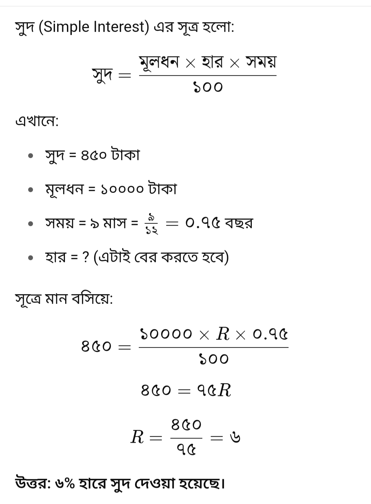
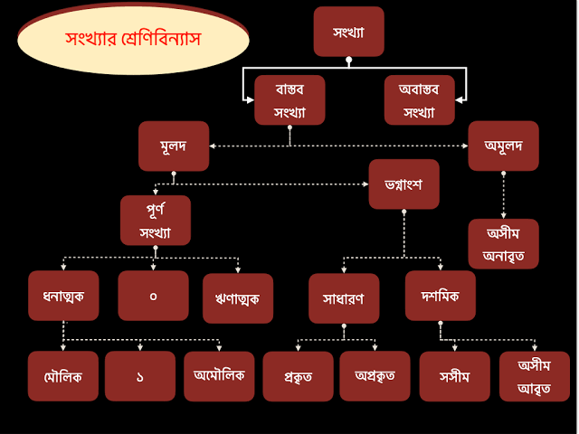

# Math-tecknik-100

(১)   কিলাইয়া হাকাইয়া ডাকাত মারিলে দেশে শান্তি মিলে।= কিলোমিটার-হেক্টর-ডেকা-মিটার-ডিসিমিটার-সেন্টিমিটার-মিলি মিটার

(2) দুধের হর উপরে ভগ্নাংশর হর নিছে।

(৩) লতি,ভতি,লভু

(৪) X= X এর উপরে থাকলে পাওয়ার , বামে থাকলে সহক, নিছে থাকলে হর। 

(৫) সুদ কসার অংক i=PRN/100 I= সুদ, P= মূল ধন , r= সুদের হার , n= সময় বা বছর যেমন= 9/12 ( 12 মাসের 9 মাস)
<!--[profile](./sud.jpg)-->

## মৌলিক সংখ্যা 

যে সব সংখ্যার 1 ছাড়া অন্য কোনো গূননিয়ক নাই। তাদের কে মৌলিক সংখ্যা বলে ।

যেমনঃ- 1,2,3,5,7,11,13,17 ইত্যাদি

## ভগ্নাংসের যোগ বিয়োগ গুন ভাগ

(1) ভগ্ন=বাঙ্গা

(২) অংশ= টুকরা

বাঙ্গা টুকরা

অনুপাত, সাধারন ভগ্নাংশ, দশমিক ভগ্নাংশ,শতকরা [একই জিনিস ]

## সরল অংক - BODMAS

BODMAS মানে:

B = Brackets (বন্ধনী)

O = Orders (ঘাত, √ ইত্যাদি)

D = Division (÷)

M = Multiplication (×)

A = Addition (+)

S = Subtraction (−)

D(Divition) এবং M (Maltiaplicatiom) — এরা সমান স্তরের অপারেশন, মানে কারও অগ্রাধিকার নেই।

✅ তাই আমরা এই দুইটি অপারেশন বাম থেকে ডানে করি। 

A (Addition) এবং S (Subtraction) — এরা সমান স্তরের অপারেশন, মানে কারও অগ্রাধিকার নেই।

✅ তাই আমরা এই দুইটি অপারেশন বাম থেকে ডানে করি।

## সংখ্যা

<!--[profile](./sonka.png)-->

### অমূলদ সংখ্যা:---
(পূর্ণ বর্গ নয় এমন সংখ্যার বর্গমূল) কে অমূলদ সংখ্যা বলে

১ ইস্কয়ার ---১*১=১

২ ইস্কয়ার --- ২*২= ৪

৩ ইস্কয়ার --- ৩*৩= ৯

উদাহরন:-- ২,৩,৫,৬,৭,৮ ইত্যাদি ( অমূলদ  সংখ্যা)

🧪 কোন রোগের জন্য কোন টেস্ট করাবেন? জেনে নিন, ভুল চিকিৎসা হতে নিরাপদে থাকুন!! 🧬

🔹 জ্বর বা ইনফেকশন হলে:
✅ CBC (Complete Blood Count)
✅ ESR
✅ Dengue, Malaria বা Typhoid Test (উপসর্গ অনুযায়ী)

🔹 ডায়াবেটিস সন্দেহ হলে:
✅ Fasting Blood Sugar (খালি পেটে)
✅ 2 Hours After Breakfast (2HABF)
✅ HbA1c (গত ৩ মাসের গ্লুকোজের গড়)

🔹 থাইরয়েড সমস্যা হলে:
✅ TSH
✅ T3, T4

🔹 লিভারের সমস্যা বা হেপাটাইটিস সন্দেহ হলে:
✅ LFT (Liver Function Test)
✅ HBsAg
✅ Anti-HCV

🔹 কিডনির সমস্যা হলে:
✅ Creatinine
✅ Urea
✅ Urine R/E (Urine Routine and Microscopy)

🔹 হার্টের সমস্যা বা বুক ধড়ফড় করলে:
✅ ECG
✅ Troponin I
✅ Lipid Profile
✅ Echocardiogram (ডাক্তারের পরামর্শে)

🔹 পেট ব্যথা, গ্যাস্ট্রিক বা হজমে সমস্যা হলে:
✅ USG Whole Abdomen
✅ Endoscopy (প্রয়োজনে)
✅ H. Pylori Test

🔹 মেয়েদের PCOS বা অনিয়মিত পিরিয়ড হলে:
✅ USG Lower Abdomen
✅ LH, FSH
✅ Prolactin
✅ TSH
✅ AMH (বাচ্চা নেওয়ার পরিকল্পনা থাকলে)।

🔹 প্রেগন্যান্সি টেস্ট:
✅ Urine β-hCG
✅ USG Pregnancy Profile

🔹 আর্থ্রাইটিস বা হাড়ের ব্যথা হলে:
✅ RA Factor
✅ CRP
✅ Uric Acid
✅ X-ray (প্রয়োজনে)।

🔹 রক্তস্বল্পতা (অ্যানিমিয়া) সন্দেহে:
✅ CBC
✅ Serum Iron
✅ Ferritin
✅ Vitamin B12

💡 মনে রাখবেন:
বিনা কারণে টেস্ট করানো যেমন ঠিক নয়, তেমনি দেরি করাও বিপজ্জনক। আপনার শরীরের সংকেতকে অবহেলা করবেন না। ভালো চিকিৎসার শুরু হয় সঠিক টেস্টের মাধ্যমে। তাই উপসর্গ দেখলেই দেরি না করে একজন রেজিস্টার্ড ডাক্তারের পরামর্শ নিন এবং প্রয়োজনীয় টেস্ট করান।

🩺 সচেতন থাকুন, সুস্থ থাকুন!..
